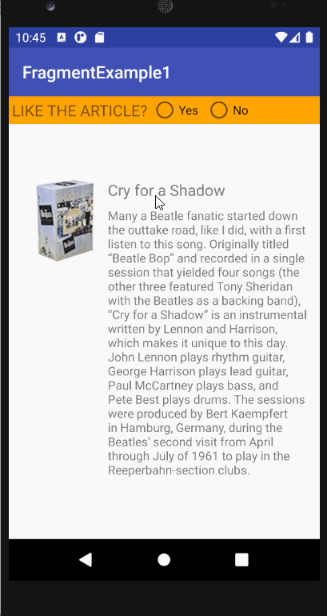
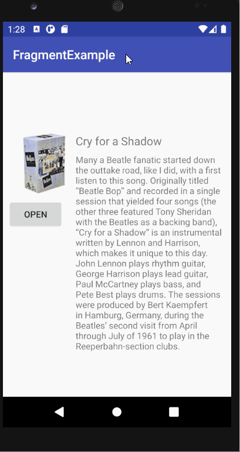
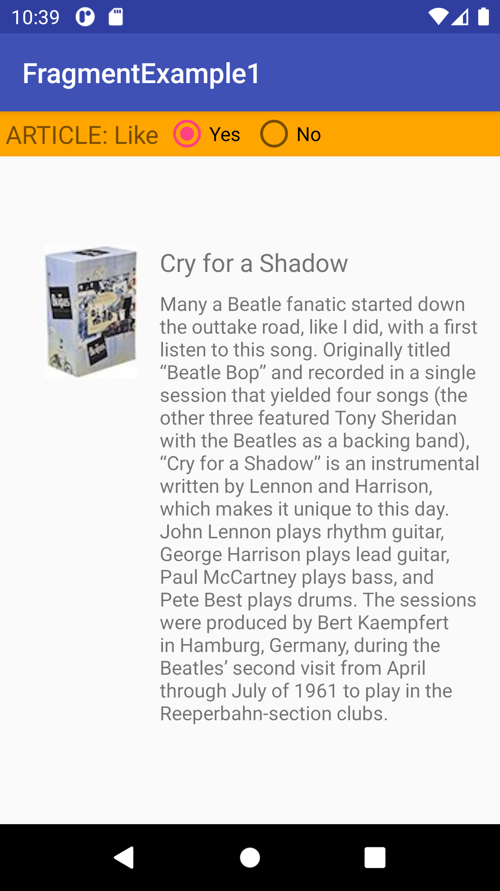
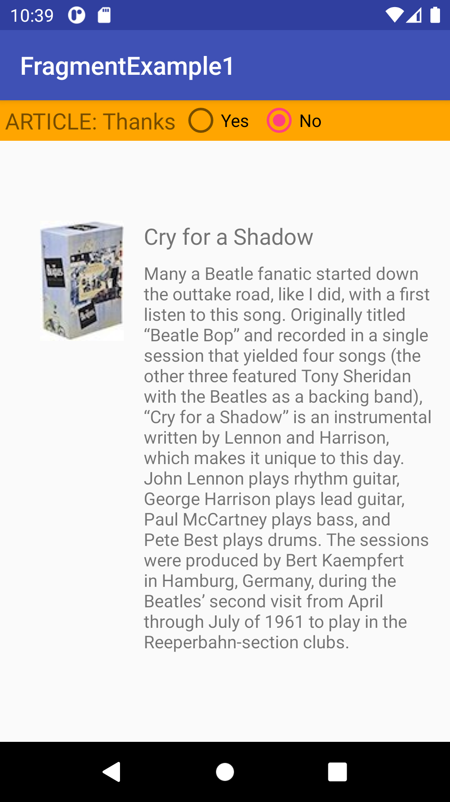

FragmentExample_start - Starter Code
====================================
<b>Task 1 gif</b>
 

 
<b>Task 2 gif</b>
 

 
Task 1
 

 
<b>Yes option pressed</b>
 

 
<b>No option pressed</b>
 
Replying
 

